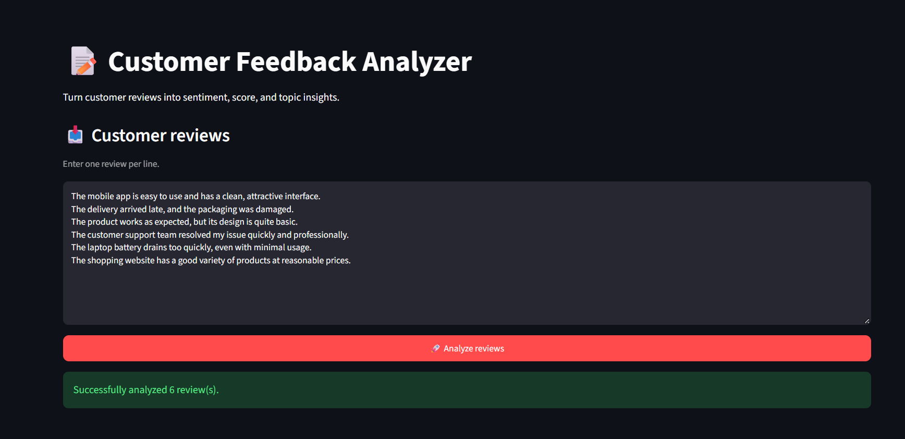
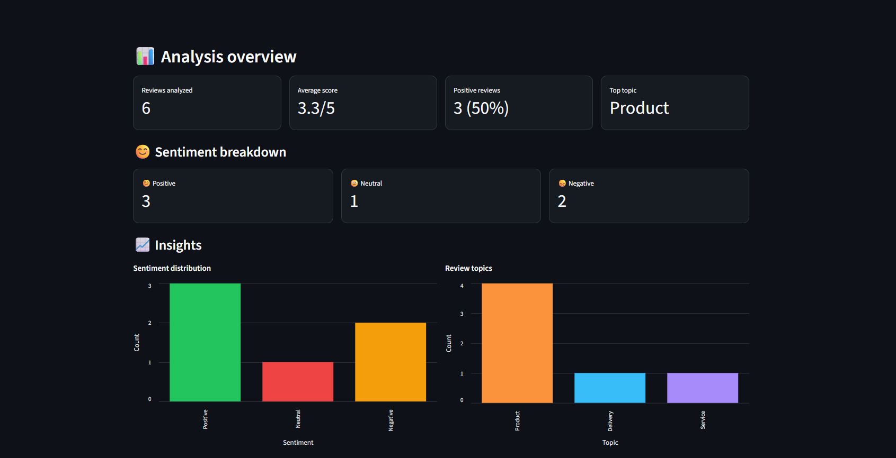
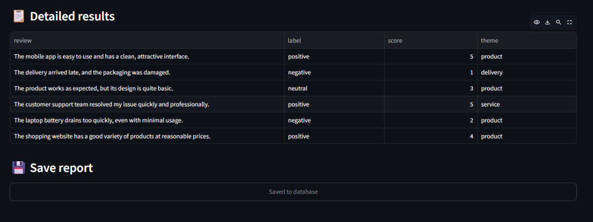
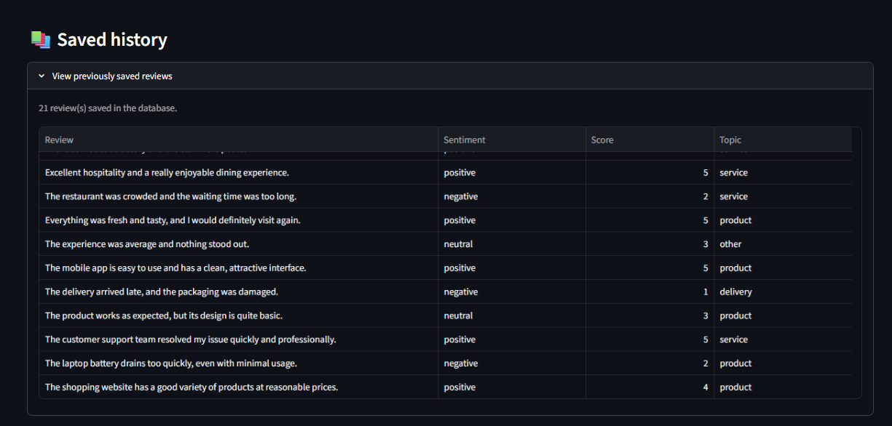

# Customer Feedback Analyzer

A small web app for analyzing customer reviews with Google Gemini. Enter one review per line to see its sentiment, a score from 1 to 5, and its main topic. The app also summarizes the results and can save them to a local SQLite database.

## Features

- Analyze multiple reviews in one submission
- Classify sentiment as positive, neutral, or negative
- Score each review from 1 to 5 and assign a topic (service, product, delivery, or other)
- View sentiment totals, average score, and topic counts
- Save results to SQLite and browse saved history

## Screenshots

### Review input and analysis status

### Insights dashboard

### Detailed results

### Saved history

## Requirements

- Python 3.10 or newer
- A Google Gemini API key
- uv (recommended), or pip

## Setup

1. Clone or download this project and open a terminal in its folder.
2. Create a .env file in the project root with your API key:

~~~env
GEMINI_API_KEY=your_gemini_api_key
~~~

Keep this key private. The .env file is ignored by Git.

3. Install the dependencies:

~~~bash
uv sync
~~~

Alternatively, with pip:

~~~bash
python -m pip install -e .
~~~

## Run the app

Start the FastAPI backend in one terminal:

~~~bash
uv run uvicorn api:app --reload
~~~

Then, in a second terminal in the project folder, start the Streamlit interface:

~~~bash
uv run streamlit run app.py
~~~

Open the local URL printed by Streamlit (usually http://localhost:8501). The backend listens at http://127.0.0.1:8000; its / route reports whether the API is running, and the app sends reviews to /analyze.

If you installed with pip instead of uv, omit uv run from the commands.

## Deploy a demo

This app uses a Streamlit frontend and a FastAPI backend, so deploy them as two services.

### 1. Deploy the FastAPI backend on Render

1. Create a new **Web Service** from this GitHub repository and select the `master` branch.
2. Set the build command to `pip install -r requirements.txt`.
3. Set the start command to `uvicorn api:app --host 0.0.0.0 --port $PORT`.
4. Add `GEMINI_API_KEY` as an environment variable in the Render dashboard. Do not put the key in this repository.
5. Deploy the service and copy its public URL, such as `https://your-api.onrender.com`.

### 2. Deploy the Streamlit frontend on Community Cloud

1. Create an app from this repository, choose the `master` branch, and set the app file to `app.py`.
2. In the app's **Settings > Secrets**, add the Render API URL:

~~~toml
API_URL = "https://your-api.onrender.com/analyze"
~~~

Replace the example URL with your deployed Render URL. The frontend reads this setting from Streamlit secrets; locally it continues to use `http://127.0.0.1:8000/analyze` by default.

This free demo setup may sleep when idle and can take about a minute to wake on its next request. Saved history uses local SQLite storage and is not guaranteed to persist across restarts or redeploys. Use an external database if you need durable history.

## Use

1. Enter one customer review per line in the text box, or copy examples from sample_reviews.txt.
2. Select **Analyze Reviews**.
3. Review the sentiment, score, topic, and summary charts.
4. Select **Save results to database** to store the displayed results in feedback.db.
5. Expand **View previously saved reviews** to see saved entries.

The **Clear** button clears the current results. It does not delete previously saved database records.

## Project files

- `app.py` - Streamlit interface, result summaries, and history view
- `api.py` - FastAPI endpoint that calls Gemini to analyze a review
- `database.py` - SQLite initialization, save, and history functions
- `sample_reviews.txt` - Example reviews for trying the app
- `screenshots/` - Screenshots displayed above in this README
- `feedback.db` - Local database created by the app; ignored by Git

## API

Send a review to the backend with a JSON request:

~~~http
POST http://127.0.0.1:8000/analyze
Content-Type: application/json

{"text": "The staff were friendly and the food was excellent."}
~~~

The response contains label, score, and theme fields. The API may return an error if the Gemini service is unavailable or its quota has been reached.
